# Market Store
> Free and responsive Ecommerce containing organic and ancestral products, shopping cart and checkout process. Free for personal and commercial use.

## Table of Contents
* [General Info](#general-information)
* [Technologies Used](#technologies-used)
* [Features](#features)
* [Screenshots](#screenshots)
* [Setup](#setup)
* [Usage](#usage)
* [Project Status](#project-status)
* [Room for Improvement](#room-for-improvement)
* [Contact](#contact)
* [License](#license)


## General Information

The following project was developed based on market research to satisfy the need to obtain organic and healthy staple foods without leaving home in the population of Ayacucho, Peru.

This research was executed with the [following survey](https://docs.google.com/forms/d/e/1FAIpQLSecQ-08M_RF1_4a8P1s0EPHft-T_plLXU_ymXtlFqfemmfdbw/viewform?fbclid=IwAR0Cloj6X2HDXETP4DTBOW6HfYmfKsH5LbyA1vYFx9koB_znbqA2ntLv0y8) using Google Forms. A total of 14 participants responded, the results of which are summarized in the following images:

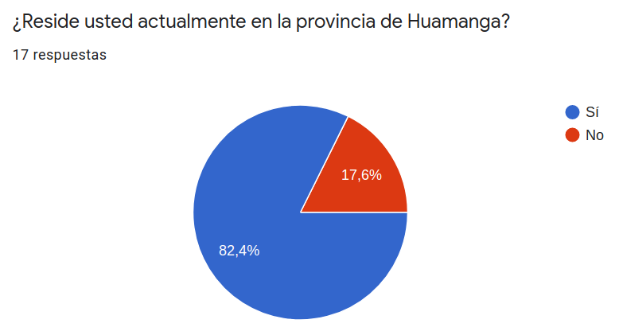
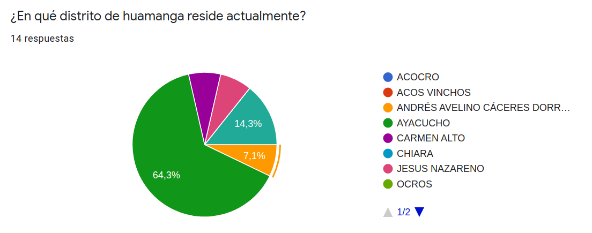
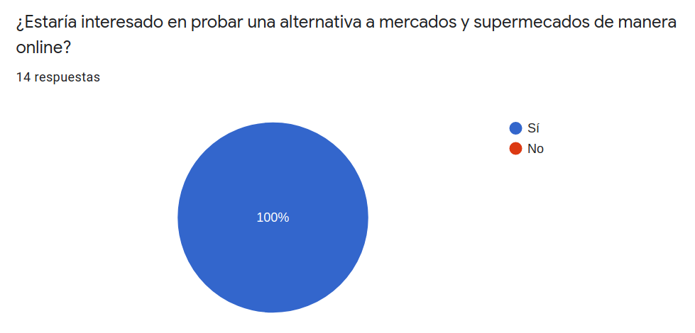
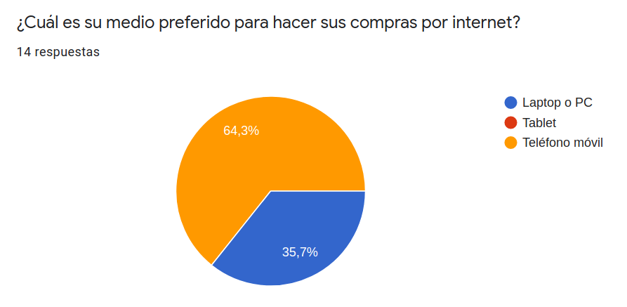
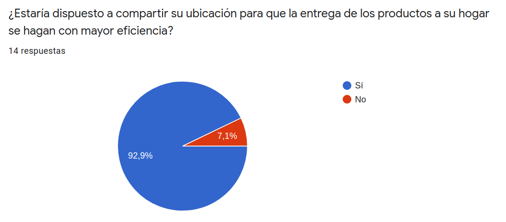
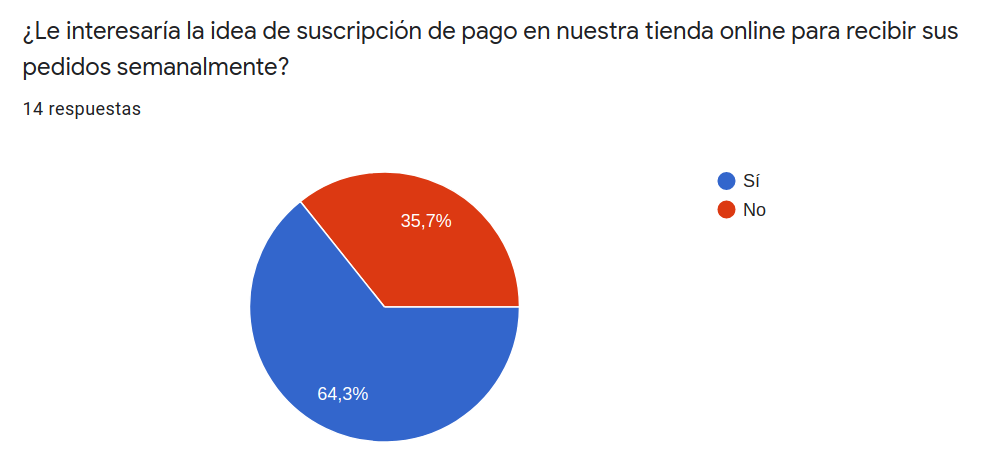
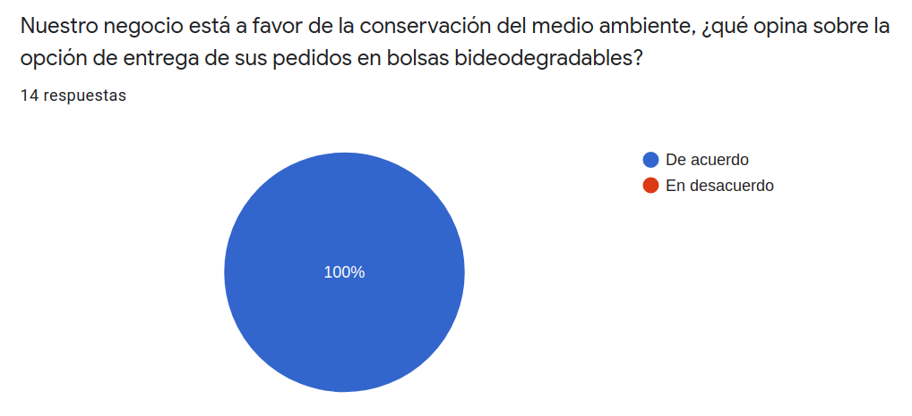
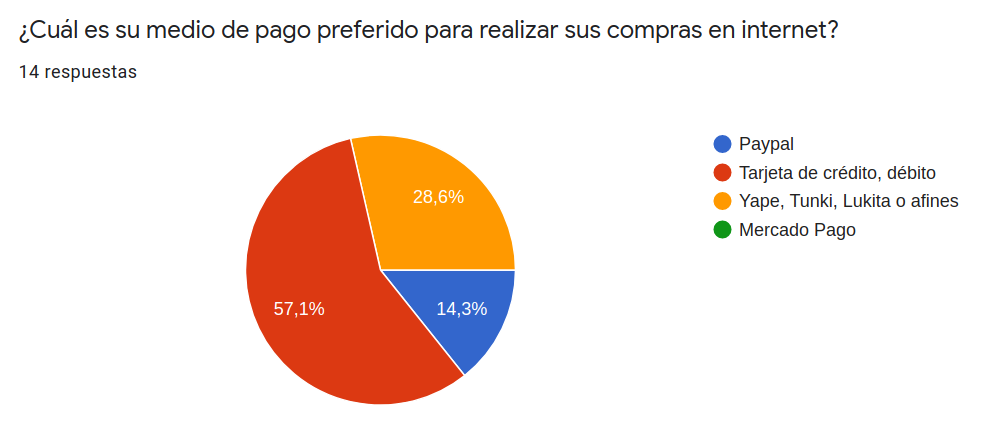
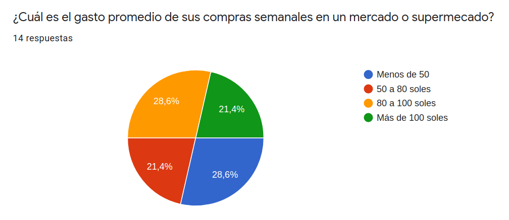
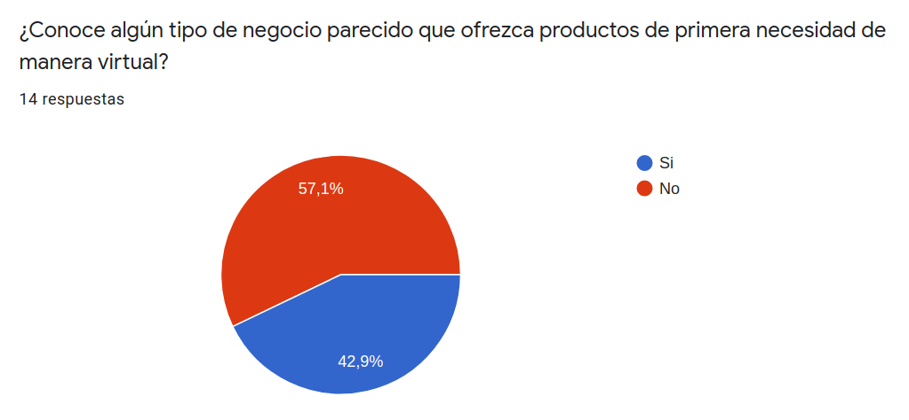
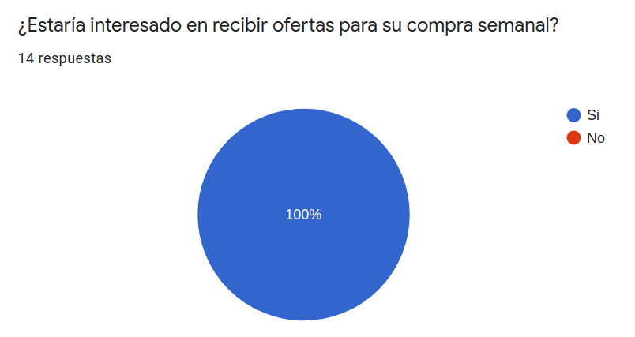
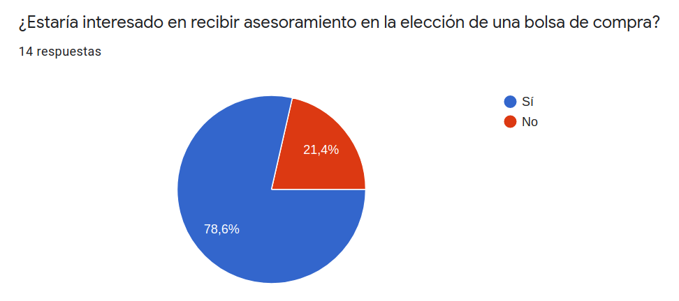
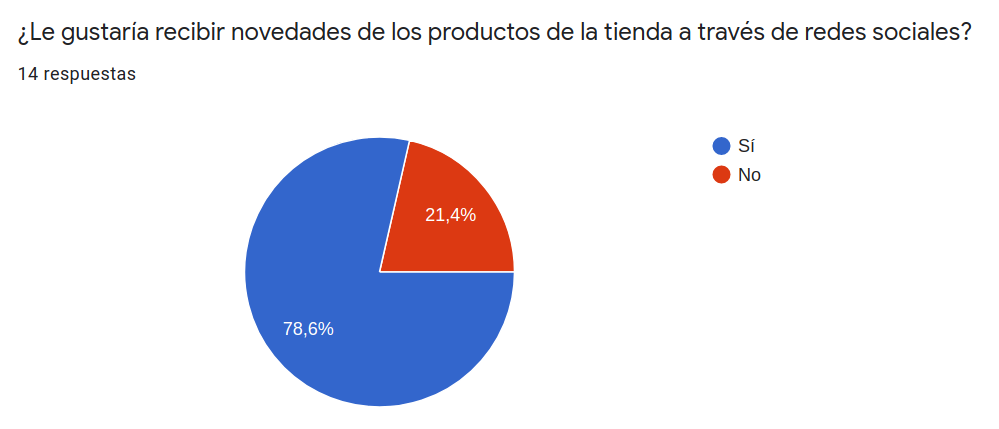

## Technologies Used

### Backend Stack
- Net core
- ASP.Net core
- Entity Framework
- SQL Server

### Frontend Stack
- Vue.js 2
- Vue Router
- Vuex
- Vuetify
- Eslint


## Features
- Product search
- Shopping cart
- Checkout proccess
- Product list with filters and ordering
- Credit card and Paypal payment methods
- Account creation and management
- User directions with geolocalization
- Order history
- Wish list
- Favorite products
- Category list
- Product packs by weeks

## Screenshots

### **Home**

### **Cart**
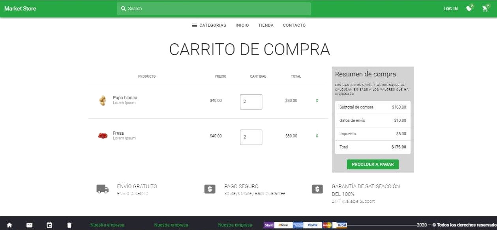
### **Login**
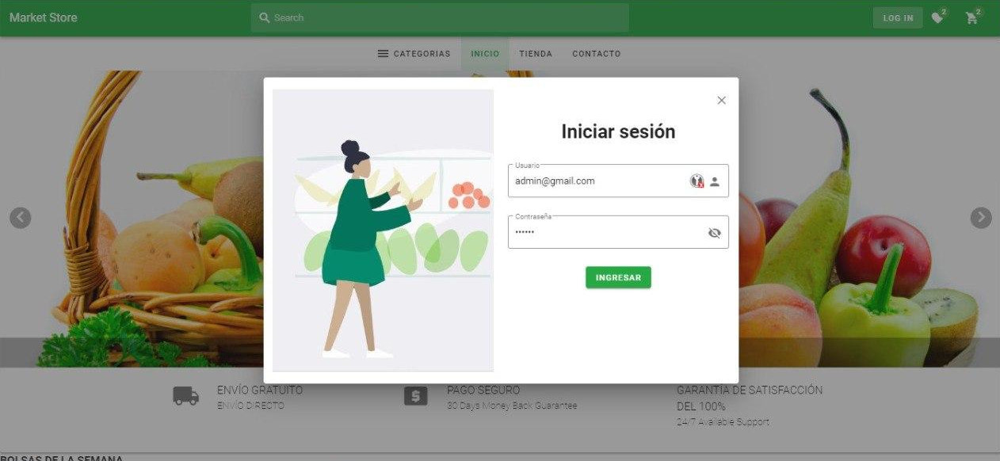
### **Products**
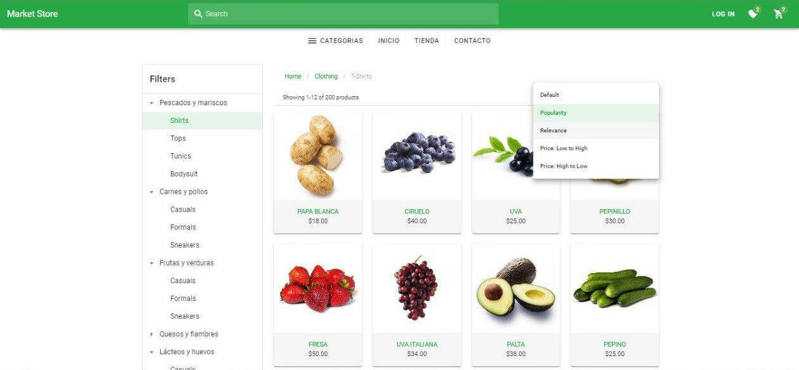


## Setup

### Requirements
* You must have [Node.js](https://nodejs.org/), wich is tipically bundled with the [npm package manager](https://www.npmjs.com/)
* You also must have [GIT](https://git-scm.com/) if you want to contribute to the project.

### Get the repository locally
First of all, clone the repository:

```bash
git clone git@github.com:lizelaser/front-end-market-store.git
cd <path_to_project>
```
### Install dependencies
Then you need to install the dependencies for the project:
```bash
npm install
```

## Usage

### Build and launch for development
Start a development server with hot-reload for development and launch the project on localhost:8080 (note that the development build is not optimized):

```bash
npm run serve
```

### Build and minifies for production
Build the project in ready-to-serve minified and static files ind dist/ folder:

```bash
npm run build
```

## Project Status

[](https://www.repostatus.org/#active)

## Room for Improvement

- Update Vue.js version to 3
- Publish a demo in a website

To do:
- Add more payment methods
- 

## Contact
Created by [@lizelaser](https://github.com/lizelaser) - feel free to contact me!

## License 
This project is open source and available under the [MIT](https://mit-license.org/) license.
