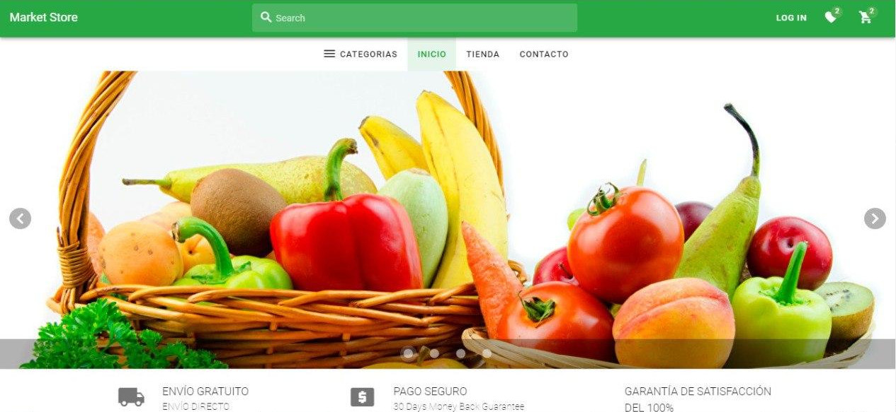

# Market Store
> Free and responsive Ecommerce containing organic and ancestral products, shopping cart and checkout process. Free for personal and commercial use.

## Table of Contents
* [General Info](#general-information)
* [Technologies Used](#technologies-used)
* [Features](#features)
* [Screenshots](#screenshots)
* [Setup](#setup)
* [Usage](#usage)
* [Project Status](#project-status)
* [Room for Improvement](#room-for-improvement)
* [Contact](#contact)
* [License](#license)

## General Information
- Organic food ecommerce.
- What problem does it (intend to) solve?
- What is the purpose of your project?
- Why did you undertake it?

## Technologies Used

### Backend Stack
- Net core
- ASP.Net core
- Entity Framework
- SQL Server

### Frontend Stack
- Vue.js 2
- Vue Router
- Vuex
- Vuetify
- Eslint

## Features
- Product search
- Shopping cart
- Checkout proccess
- Product list with filters and ordering
- Credit card and Paypal payment methods
- Account creation and management
- User directions with geolocalization
- Order history
- Wish list
- Favorite products
- Category list
- Product packs by weeks

## Screenshots

## Setup
What are the project requirements/dependencies? Where are they listed? A requirements.txt or a Pipfile.lock file perhaps? Where is it located?

Proceed to describe how to install / setup one's local environment / get started with the project.

## Usage
How does one go about using it?
Provide various use cases and code examples here.

`write-your-code-here`

## Project Status
Project is: _complete_

## Room for Improvement

- Update Vue.js version to 3
- Serve to production on a live environment

To do:
- Add more payment methods
- 

## Contact
Created by [@lizelaser](https://github.com/lizelaser) - feel free to contact me!

## License 
This project is open source and available under the [MIT](https://mit-license.org/) license.
